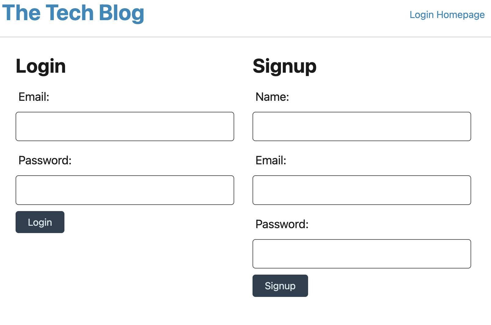
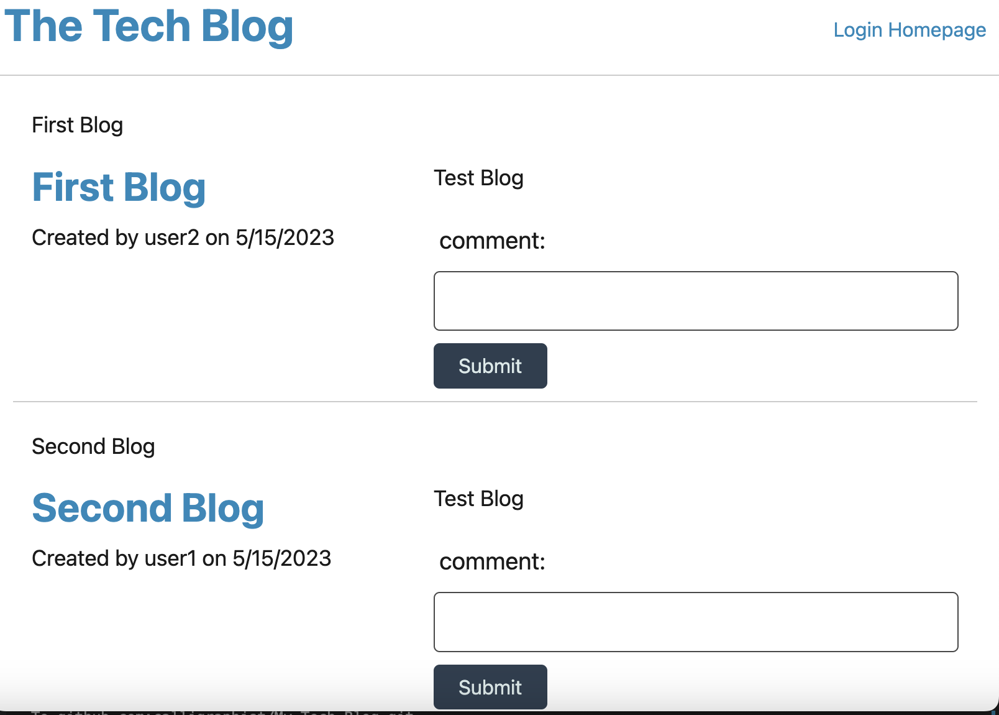
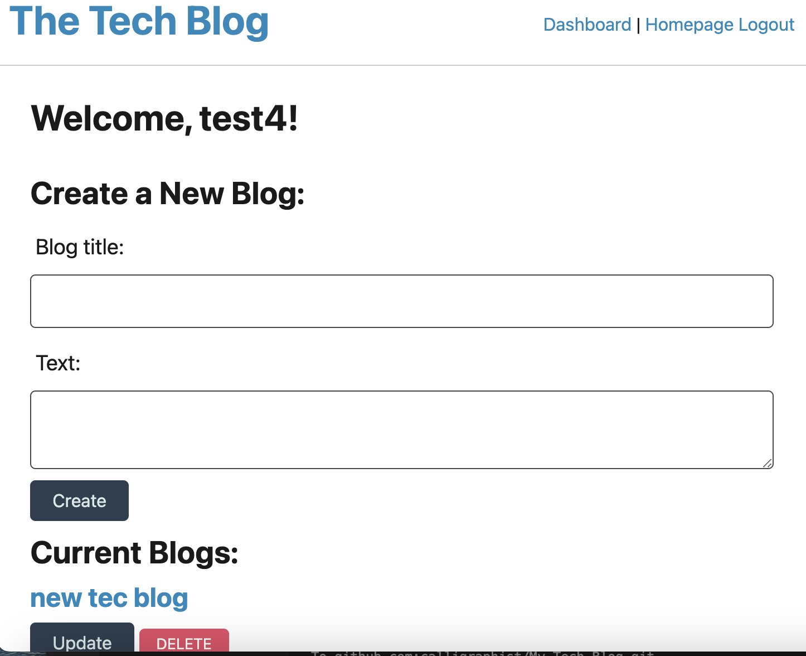

# My-Tech-Blog

### Contents

1. Discription of Project
2. Screenshot
3. Heroku link 
4. Acknowledgements
5. Questions

## Description of Project
This is to build a CMS-style blog site, where developers can publish their blog posts and comment on other developers’ posts as well. It is deployed to Heroku. this application follows MVC paradigm in its architectural structure, using Handlebars.js as the templating language, Sequelize as the ORM, and the express-session npm package for authentication.

## Screenshot
Following is the screenshot of my application:

## Heroku link

## Acknowledgements

This project is done for UNB Bootcamp, thanks for the opportunity. I am thankful to my tutor for all the help. AskBCS is really appreciated. Miniproject was a big help.

## Questions

If you have any questions, please reach out to me at my github.

https://github.com/calligraphist

---
© 2023 edX Boot Camps LLC. Confidential and Proprietary. All Rights Reserved.

## Your Task

Writing about tech can be just as important as making it. Developers spend plenty of time creating new applications and debugging existing codebases, but most developers also spend at least some of their time reading and writing about technical concepts, recent advancements, and new technologies. 
Your task this week is to build a CMS-style blog site similar to a Wordpress site, where developers can publish their blog posts and comment on other developers’ posts as well. You’ll build this site completely from scratch and deploy it to Heroku. Your app will follow the MVC paradigm in its architectural structure, using Handlebars.js as the templating language, Sequelize as the ORM, and the express-session npm package for authentication.

## Mock-Up

The following animation demonstrates the application functionality:

 

You’ll also need the [dotenv package](https://www.npmjs.com/package/dotenv) to use environment variables, the [bcrypt package](https://www.npmjs.com/package/bcrypt) to hash passwords, and the [express-session](https://www.npmjs.com/package/express-session) and [connect-session-sequelize](https://www.npmjs.com/package/connect-session-sequelize) packages to add authentication.

 

---
© 2023 edX Boot Camps LLC. Confidential and Proprietary. All Rights Reserved.
